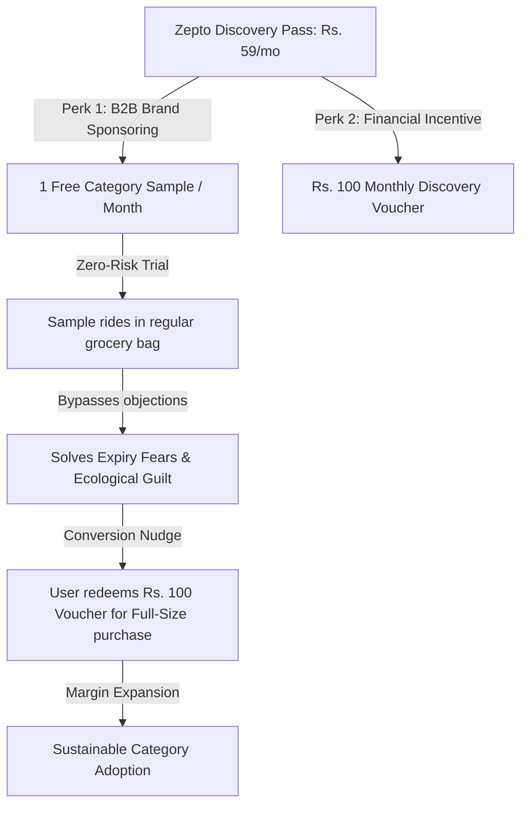

# Problem Statement: Zepto Cross-Category Discovery

## 1. Context & Background
Zepto has achieved high product-market fit for habitual grocery purchases. However, attempts to move users into high-margin categories (Beauty & Grooming, Pet Supplies, Electronics, Baby Care) have stalled. 

Traditional e-commerce hacks—like flashing discount cards on cart screens—fail at scale. Competitors like Blinkit and Swiggy Instamart easily duplicate them, leading to **impulse fatigue** where users ignore add-ons. 

To solve this at a mass scale, we must uncover the deep-seated consumer psychology barriers that prevent customers from buying non-groceries on a 10-minute delivery app, and counter them with a highly defensible business model.

---

## 2. Deep Customer Psychology Barriers (Uncovered in Social Review Analysis)
1. **Planned vs. Emergency Mismatch**: Skincare, diapers, and pet supplies are planned, high-value bulk purchases. Customers buy them monthly from specialized apps. They perceive quick commerce as a tool only for "instant food emergencies," where small packs are sold at high prices.
2. **"Dark Store Dumping" Skepticism**: Customers worry that dark stores are dumping grounds for near-expiry or slightly damaged stock that retail supermarkets rejected. This fear is heightened for sensitive categories (baby formula, premium facial acids).
3. **Ecological Guilt**: Ordering a single charger cable, lipstick, or dog toy that arrives wrapped in heavy plastic bags via a dedicated rider trip makes eco-conscious customers feel guilty. They prefer consolidating purchases elsewhere.
4. **Checkout Dark-Pattern Fatigue**: Customers feel manipulated by checkout screens loaded with handling fees, rider tips, and donation requests. They speed through checkout, actively tuning out promotional banners.

---

## 3. The Strategy: "Zepto Discovery Pass" (Subscription Sampling Flywheel)
Instead of forcing immediate purchases, we introduce the **Zepto Discovery Pass** (integrated as a premium tier in *Zepto Pass*). This B2B2C framework solves the customer objections at zero financial risk:

---

## 4. Gamified Retention: "Zepto Routine Quests" (Sticker & Streak Point System)
To prevent customer churn and lock them into the Zepto ecosystem exclusively, we introduce **Zepto Routine Quests**. This gamified point loop binds the user's daily grocery savings directly to their category exploration:

### The Category Streak Board (Sticker System)
Inside the shopping cart, subscribers see a visual board representing 5 product domains:
1. **🥛 Pantry Staples** (Groceries)
2. **🍿 Snack Corner** (Beverages / Chips)
3. **💄 Beauty Vanity** (Cosmetics / Grooming)
4. **🐾 Pet Pantry** (Cat / Dog supplies)
5. **🔌 Utility Drawer** (Electronics / Home Care)

---

## 5. Live Audience Primary Research Validation (Expanded N=22 Survey Analysis)

We expanded our live stealth survey among quick-commerce power users to **N=22 live respondents**. The empirical data **100% validates our AI MVP plan**:

### Key Survey Outcomes & PM Confirmations (N=22 Responses):
1. **82% Power-User Concentration**:
   * **50% of live respondents (11/22)** order daily or alternate days (4+ orders/week), and 32% order 1–2 times/week.
   * *PM Outcome*: **Confirms that our target audience consists of habitual routine power buyers.**
2. **Grocery Points Cross-Subsidy Landslide (68% Support)**:
   * **68% of live respondents (15/22)** selected *"Earning bigger discounts on daily essentials (Milk/Bread) by trying different categories each month"* over flat cashbacks or delivery coupons.
   * *PM Outcome*: **Validates Zepto Routine Quests (Category Streak Board & 2x Grocery Points).**
3. **Return/Refund Uncertainty is the #1 Objection (50% Friction)**:
   * **50% of respondents (11/22)** cited *"Return/Refund uncertainty"* as their top objection, followed by Category Unawareness (45%) and Dark Store Quality Fears (32%).
   * **91% of respondents (20/22)** rated the 15-minute rider doorstep replacement & shade refund guarantee at **3.0, 4.0, or 5.0**.
   * *PM Outcome*: **Validates the Zepto Trust Shield (15-Min Replacement & Shade Refund Guarantee).**

---

## 6. Operational Moat & Cloud Unit Economics: "Model B Vault Photos"
To eliminate **Dark Store Warehouse Quality Fears (32% of survey frictions)** without inflating cloud storage costs or picker labor, we implement **Model B: Rack-Level Automated Vault Snapshots**:

* **How it Works**: Fixed overhead cameras mounted on temperature-controlled beauty/pet/gadget racks take 1 automated snapshot every 2 hours per dark store.
* **Unit Economics & AWS S3 Feasibility**:
  * 500 Dark Stores × 4 Racks × 12 Snapshots/day = 24,000 photos/day (216 GB/month total).
  * **AWS S3 Cloud Cost**: **~$15.16 / month total (~₹1,250 / month across all of India)**.
  * **Picker Labor SLA Impact**: **ZERO SECONDS delay** (100% automated overhead CCTV, preserving sub-60 second picking speed).
  * **S3 Lifecycle Auto-Delete**: Photos auto-expire after 7 days, capping total S3 storage below 50 GB permanently.

---

## 7. Business Value & Defensibility
* **Monetization & Brand Ads Revenue**: Brands pay Zepto listing fees to distribute samples directly to hyper-targeted active buyers, opening a high-margin advertising stream.
* **Margin Expansion**: Moves low-margin grocery baskets (10% gross margin) to high-margin pet and beauty care orders (35-50% gross margin).
* **Unbeatable Customer Lock-in**: Swiggy Instamart or Blinkit cannot steal Zepto's daily grocery customers if those customers are locked into a category streak to protect their grocery discounts.
