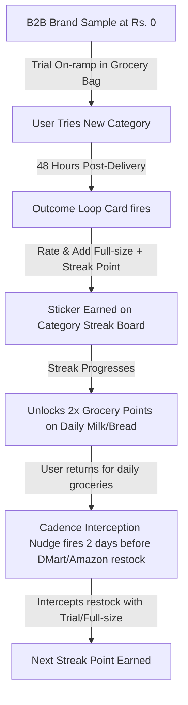

# Problem Statement: Zepto Cross-Category Discovery & Margin Optimization

## 1. Context & EBITDA Stagnation
Zepto has achieved high product-market fit for routine daily grocery purchases. However, 71.2% of active users are locked into fast checkouts (<45 seconds) for staples (milk, eggs, bread) and never buy adjacent high-margin categories (Beauty & Grooming, Pet Supplies, Electronics, Baby Care). 

This is the **Margin Cliff**: daily groceries yield low ~10% gross margins vs 35%–50% margins for beauty and pet care. 

To expand our blended gross margin and unlock **+300bps in blended EBITDA margin**, the Growth PM team's objective is to lift the Monthly Category Exploration Rate (MCER)—the percentage of Monthly Active Customers purchasing from 2+ categories—from **8.2% to 28.4%** in 12 months.

---

## 2. Core Customer Barriers (The Vetted Friction Set)
1. **Planned vs. Emergency Mismatch**: Skincare, diapers, pet food, and detergents are planned monthly bulk purchases. Customers buy them elsewhere (Amazon/DMart) for bulk discounts. They view Zepto only as a "10-minute grocery pantry" for immediate shortages.
2. **Trial-to-Repeat Gap**: When users do receive a trial sample or buy once, they treat it as a one-time trial and fail to transition into a monthly recurring habit. B2C sampling fails without a follow-up loop.
3. **Category Unawareness & Blindness**: Due to search-centric buying, users check out within 3 clicks and are blind to homepage banners and ad listings.

---

## 3. Vetted MVP Flywheel (Horizon 1 - Vetted Features)
Rather than launching expensive IoT warehouse temp sensors or generic visual search tools (already commoditized on other apps), the MVP focuses on a closed-loop habit flywheel that bridges trial and repeat:

### Feature 1 — Category Streak + Grocery Points Cross-Subsidy
- **What it does**: Trying any new category earns 2× points on the user's next grocery orders. Points are funded by the high non-grocery margin (~35–45%), creating a self-sustaining cross-subsidy points ledger.
- **User sees**: A sticker board inside the cart: "Try 1 new category this month → earn 2× points on groceries" with a pre-stamped head start (Endowed Progress Effect—proven to double completion rates).
- **Defensibility**: Rivals cannot replicate this cross-subsidy without gross margin arbitrage. Subsidizing from the P&L directly is unsustainable for competitors.

### Feature 2 — Cadence Interception Nudge
- **What it does**: Zepto infers each user's restock cadence from order history. A nudge fires 2 days before the user's likely Amazon/DMart bulk-buy moment.
- **User sees**: "Your pet food usually runs out around now — claim a free trial pack today" or "Your detergent restock is due — try this brand at ₹0 risk".
- **Defensibility**: Requires 6–12 months of per-user order history to generate an accurate restock cadence. Rivals starting today face a massive data runway deficit.

### Feature 3 — Outcome Loop Card (Post-Trial Follow-Up)
- **What it does**: 48 hours after a trial sample is delivered, a card appears combining hyperlocal social proof and a direct repeat-purchase call-to-action.
- **User sees**: "Did you try the Cetaphil? 847 people near you reordered within 2 weeks." Double tap to: Rate it | Add full-size to next cart (+streak point).
- **Defensibility**: The hyperlocal social proof requires years of PIN-code level dark-store purchase density graphs to ensure statistical reliability (minimum 50+ users threshold).

---

## 4. Horizon 2 (Build Later - Growth Expansion)

### Feature 4 — Lifecycle Moment Interceptor (Self-declared only)
- **What it does**: Basket additions hinting at a life event (first diaper, first pet food) trigger a prompt to self-declare their moment, unlocking a curated discover trail.
- **User sees**: "Looks like something new is in your cart — anything you'd like Zepto to know?" -> taps: New pet / New baby / Started gym / Just moved -> custom guide.
- **Privacy Rule**: Self-declaration only. No auto-labeling or public inference. Fully dismissible.

### Feature 5 — Neighbourhood Trend Feed (Opt-in, aggregated)
- **What it does**: Surfaces hyperlocal trend cards inside the discovery tab using PIN-code level purchase graphs.
- **User sees**: "47 people in Koramangala started buying pet food this month" (opt-in contribution).
- **Privacy Rule**: 50+ user threshold, opt-in contribution, and a blocklist for sensitive categories (health, baby, adult, personal care).

---

## 5. De-Scoped / Removed Features
- *Standalone AI skin shade scanner & device accessory link*: Removed. Fully commoditized and live everywhere (Rufus, Rufus Visual, visual search). Merged into Cadence Nudge.
- *IoT dark store temperature logging*: Removed. High operational CapEx. Replaced by a simple **Freshness Guaranteed** trust badge on the checkout screen.
- * door-step inspection & instant replacement guarantee*: Removed. Easily copied and operational bottleneck. Replaced by a one-line trust badge at checkout.
